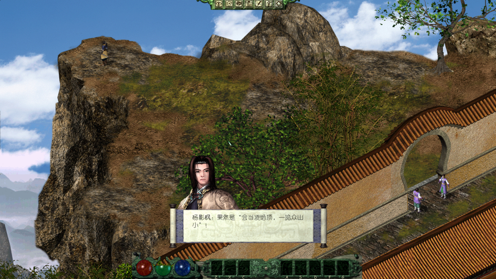
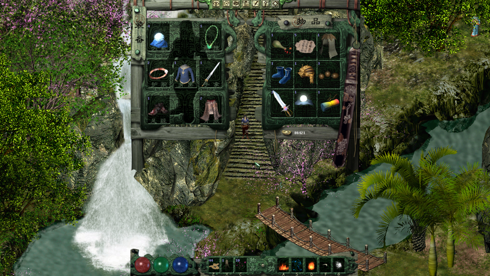
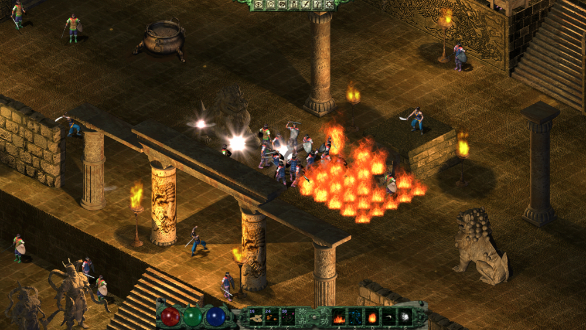

# 剑侠情缘外传 月影传说 高清版

## Environment Setup
### Requirement
1. XNA
2. Visual Studio 2013

### Steps
1. Install	Visual Studio 2015
2. Download and install XNA	[XNA Game Studio 4.0.5 for vs2015.zip](https://github.com/mapic91/JxqyHD/releases/tag/Jxqy_MD5_6E393C16A03FEDC4FF1406205D2EA785.7z)
3. Download the game resource and patch with Update.7z	[Jxqy_MD5_6E393C16A03FEDC4FF1406205D2EA785.7z](https://github.com/mapic91/JxqyHD/releases/tag/Jxqy_MD5_6E393C16A03FEDC4FF1406205D2EA785.7z)
4. Set the build target path to the game resource dir.
5. Compile and run.

### Screenshots

